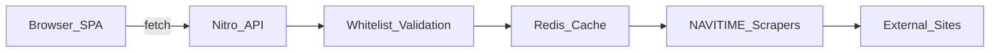

# わかめナビ — 2026-07 大規模リファクタリング記録

実施日: 2026-07-10  
対象ブランチ: `v2_base`（本ドキュメント作成時点では未コミット）  
目的: プロジェクト俯瞰調査に基づき、信頼性・保守性・セキュリティ・品質基盤をまとめて改善する

---

## 1. 背景

埼玉大学周辺のバス運行情報アプリ「わかめナビ」は、Nuxt 4 SPA + Nitro API + NAVITIME 系スクレイピングという構成の小規模公開サービスである。  
共有型・SSRF 対策・レート制限・CSP など本番意識の実装は既にあった一方、次のリスクが調査で顕在化した。

- 外部スクレイピング依存が単一障害点
- 巨大 composable・API パス二重化・ドキュメント乖離
- テスト / CI / README 不在
- Nuxt 既知 CVE、本番ソースマップ、CSP / レート制限の緩さ

本リファクタリングは、分析で挙げた改善項目を段階的に実装したものである。

---

## 2. 事前調査の要約

調査は次の 4 観点で実施した。

### 2.1 全体設計

| 項目 | 調査時点の状態 |
|------|----------------|
| 構成 | `app/`（SPA） / `server/`（Nitro API） / `shared/`（型・スクレイパー・路線マスタ） |
| データ取得 | フロント → `/api/v2/bus/*` → Redis キャッシュ → NAVITIME スクレイピング |
| DB / Auth | なし（公開読み取り専用として妥当） |
| 主な問題 | API 二方式共存、未使用 routes API、二重キャッシュ、路線マスタのメンテ分散 |



### 2.2 詳細設計

| 項目 | 調査時点の状態 |
|------|----------------|
| 強み | コンポーネント分割、graceful degradation、かな/ローマ字検索 |
| 問題 | `useBusTimetable.ts` 約 640 行の God composable |
| 問題 | 結果ページに API 定期リフレッシュなし（時計のみ 1 秒更新） |
| 問題 | API 失敗時のサイレント空配列フォールバック |
| 問題 | 会社コード `Kokusai` / `KokusaiKogyo` の表記ゆれ |

### 2.3 セキュリティ

| 深刻度 | 所見 |
|--------|------|
| High | Nuxt `4.4.6` に既知 CVE（修正版 `>=4.4.7`） |
| Medium | 本番ソースマップ有効 |
| Medium | CSP の `'unsafe-inline'` |
| Medium | Redis 障害時レート制限がインスタンス単位に退化 |
| 良好 | SSRF 対策（固定 URL + ID ホワイトリスト）、パラメータホワイトリスト、`v-html` 不使用 |

### 2.4 その他（運用・品質）

- テストファイル・テストランナー・CI がゼロ
- ルート README / `.env.example` 不在
- `API.md` / `Types.md` と実装の乖離
- PWA は `manifest.json` のみ

---

## 3. 実施した対応

実装は大きく 3 フェーズで進めた。

1. 即効改善 + セキュリティ強化
2. 信頼性 + 保守性
3. 品質基盤 + 残課題の一括消化

### 3.1 即効改善（quick-wins）

| 対応 | 内容 |
|------|------|
| Nuxt アップグレード | `^4.4.6` → `^4.4.7`（解決版 4.4.8 系） |
| 本番ソースマップ無効化 | `nuxt.config.ts` で `sourcemap.client/server: false` |
| 未使用依存削除 | `@mdi/font` |
| デッドコード削除 | 空の `Time.getNow()`、廃止済み `BusStops.ts` |

### 3.2 セキュリティ強化（hardening）

| 対応 | 内容 |
|------|------|
| CSP | 未使用 CDN 削除、`img-src` 限定、`object-src` / `base-uri` / `frame-ancestors` / `form-action` / `worker-src` 追加。`'unsafe-inline'` は Nuxt SPA + Tailwind + gtag のため残存（方針をコメント記載） |
| キャッシュ | Nitro `defineCachedEventHandler` と Redis の二重キャッシュをやめ、**Redis のみ**（TTL 60s） |
| レート制限 | **本番は Redis 必須**。未設定・通信失敗時は **503 fail-closed**。開発のみインメモリフォールバック |
| a11y | `StopSelector` に combobox ARIA（`role` / `aria-expanded` / `aria-activedescendant` 等） |

### 3.3 信頼性（reliability）

| 対応 | 内容 |
|------|------|
| 定期リフレッシュ | 結果ページで **45 秒**ごとに `refreshData({ silent: true })` |
| API エラー UI | `fetchError` + インライン再試行。マイルート上限は `alert()` ではなく通知メッセージ |
| スクレイパー堅牢化 | 国際興業に `response.ok`、両社に構造化 `console.error` / `warn` |

### 3.4 保守性（maintainability）

#### composable 分割

```
useBusTimetable (facade)
├── useMyRoutes …… localStorage / pin / apply
├── useTimetableData …… fetch + timetable + fetchError
├── busCompany …… Kokusai ↔ KokusaiKogyo
├── busTypes …… TimetableEntry / MyRoute
└── useDragReorder …… MyRoutes / Pinned 共通
```

既存ページの import はファサード経由で維持。

#### API / ドキュメント

- フロントの取得パスを ID パラメータ（`kokusaiStartId` 等）に整理
- 検索ページ mount 時の不要な `refreshData()` を削除
- `API.md` / `Types.md` を実装に同期（429、`?local`、西武 `__NUXT_DATA__` 等）

### 3.5 品質基盤（quality-ci）

| 対応 | 内容 |
|------|------|
| Vitest | 単体テスト導入（validation / busStopSearch / busTimeUtils 等） |
| スクリプト | `lint` / `typecheck` / `test` / `test:watch` |
| README | セットアップ・環境変数・デプロイ・`?local`・スクリプト |
| `.env.example` | `KV_REST_API_URL` / `KV_REST_API_TOKEN` |
| GitHub Actions | `.github/workflows/ci.yml`（lint / typecheck / test 必須、audit は参考） |

### 3.6 追加で消化した残課題

| 課題 | 決定と実装 |
|------|------------|
| typecheck 厳格エラー | 実修正して通過。CI でブロッキング化 |
| レガシー API | `start` / `goal` / `company` を **削除**。ID パラメータのみ |
| `/api/v2/bus/routes` | フロント未使用のため **エンドポイント削除** |
| 路線マスタ集約 | 正本は `Routes.ts` の `ALL_ROUTES`。よみがなは `StopKana.ts`。名前ホワイトリストは導出 |
| PWA | `@vite-pwa/nuxt`（シェルキャッシュ、API は NetworkOnly）。旧 `public/manifest.json` はモジュール生成に移行 |
| マイルート検証 | `isKnownStopName` で停留所ホワイトリスト照合し不正エントリを除外 |
| Vitest 4 | Vitest 4.1.x へ移行成功（Windows ドライブレター問題は `vitest.config.ts` の root 正規化で回避） |

---

## 4. 破壊的変更・運用上の注意

### 4.1 API 破壊的変更

- `GET /api/v2/bus/services` のレガシークエリ `start` / `goal` / `company` は **廃止**
- 利用可能なクエリは ID 系のみ（`kokusaiStartId` / `kokusaiGoalId` / `seibuStartId` / `seibuGoalId`）
- `GET /api/v2/bus/routes` は **削除**

詳細は [`app/API.md`](../app/API.md) を参照。

### 4.2 本番環境変数（必須）

| 変数 | 用途 |
|------|------|
| `KV_REST_API_URL` | Upstash Redis REST URL |
| `KV_REST_API_TOKEN` | Upstash Redis REST トークン |

**本番で未設定の場合、レート制限基盤が使えないため API は 503 を返す。**  
ローカル開発では未設定でも動作する（制限・キャッシュは弱体化）。

### 4.3 PWA

- インストール可能な PWA として動作
- オフラインはアプリシェル中心。運行データの完全オフラインは対象外
- 本番デプロイ後に Service Worker 登録を一度確認すること

---

## 5. 主な変更ファイル一覧

### 新規

| パス | 役割 |
|------|------|
| `README.md` | セットアップ・運用ドキュメント |
| `.env.example` | 環境変数雛形 |
| `.github/workflows/ci.yml` | CI |
| `vitest.config.ts` / `tests/**` | 単体テスト |
| `app/composables/bus/useMyRoutes.ts` | マイルート |
| `app/composables/bus/useTimetableData.ts` | 取得・時刻表 |
| `app/composables/bus/busCompany.ts` | 会社コード変換 |
| `app/composables/bus/busTypes.ts` | UI 型 |
| `app/composables/bus/useDragReorder.ts` | DnD 共通化 |
| `shared/utils/Bus/v2/StopKana.ts` | よみがなマスタ |
| `docs/REFACTORING_2026-07.md` | 本ドキュメント |

### 削除

| パス | 理由 |
|------|------|
| `server/api/v2/bus/routes.ts` | フロント未使用 |
| `shared/utils/Bus/v2/BusStops.ts` | `Routes.ts` に一本化済みの廃止ファイル |
| `public/manifest.json` | `@vite-pwa/nuxt` 生成に移行 |

### 重点更新

| パス | 内容 |
|------|------|
| `nuxt.config.ts` | sourcemap OFF、PWA モジュール |
| `server/api/v2/bus/services.ts` | Redis キャッシュ一本化、レガシー削除 |
| `server/middleware/rateLimit.ts` | 本番 Redis 必須 / fail-closed |
| `server/middleware/security.ts` | CSP 強化 |
| `app/composables/bus/useBusTimetable.ts` | ファサード化 |
| `app/pages/bus/result.vue` | ポーリング・エラー UI |
| `shared/utils/Bus/v2/Routes.ts` | 停留所ホワイトリスト導出 |
| `shared/utils/Bus/v2/KokusaiKogyoBus.ts` / `SeibuBus.ts` | `response.ok`・構造化ログ |
| `app/API.md` / `app/Types.md` | 実装同期 |
| `package.json` | Nuxt / Vitest / PWA / スクリプト |

---

## 6. 検証結果（実施時点）

| コマンド | 結果 |
|----------|------|
| `npm run typecheck` | 成功（CI 必須化） |
| `npm test` | 成功（Vitest 4） |
| `npm run lint` | 成功（既存 warning のみの場合あり） |
| `npm run build` | 成功（`sw.js` / webmanifest 生成を確認） |

---

## 7. 未着手・今後の候補

本リファクタリングでは意図的に残した、またはプロダクト判断が必要な項目。

| 優先度 | 項目 | 備考 |
|--------|------|------|
| 中 | スクレイパー監視の本格化 | 構造化ログはある。空レスポンス連続・パース失敗のアラート / ヘルスチェックは未整備 |
| 中 | CSP `'unsafe-inline'` 除去 | nonce/hash 化にはビルドパイプライン改修が必要 |
| 低 | 電車タブ | ナビに残るが未実装。削除かプレースホルダ明示 |
| 低 | SSR 再検討 | 現状 `ssr: false`。OGP は静的メタで足りるなら維持でも可 |
| 運用 | 本番 PWA インストール確認 | Vercel 上での SW 登録確認 |
| 運用 | 変更のコミット / PR | 本ドキュメント作成時点では未コミット |

---

## 8. 関連ドキュメント

- [README](../README.md) — セットアップ・環境変数・スクリプト
- [API 仕様](../app/API.md)
- [型定義](../app/Types.md)
- [`.env.example`](../.env.example)
